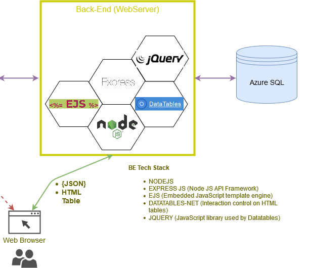

# Web API Server with Express JS

ejswebapi is a very simple web api server application which serves relational data coming from a SQL Database table.

The retrieved data can be consumed with JSON format, or can be rendered through an HTML data table.

The HTML interface uses EJS and Datatables to allow the user to explore the data and execute new queries against the DB.
The connection to the DB is done using Tedious.

## Installation

- You´ll need to installed [Node JS](https://nodejs.org/en/download/). Version used v8.9.4.
- Clone/fork this repo
- `npm install`
- app.js: enable indexRouter in the middleware section.
- index.js: set your DB connection, schema, metadata...
- adapt to your needs and enjoy

## Starting the server
DEBUG=ejswebapi:* npm start

## Getting started
Navigate to http://127.0.0.1:3000 , you´ll find a web page where you can explore the data and retrieved new data from DB based on 1 parameter __txid__: http://127.0.0.1:3000/?txid=

You can also retrived records in JSON format using:
http://127.0.0.1:3000/?txid=mytxid&out=json

## Technology Stack

## References

- [Express JS](https://expressjs.com/)
- [Embedded JavaScript templating](https://ejs.co/)
- [DataTables](https://datatables.net/)
